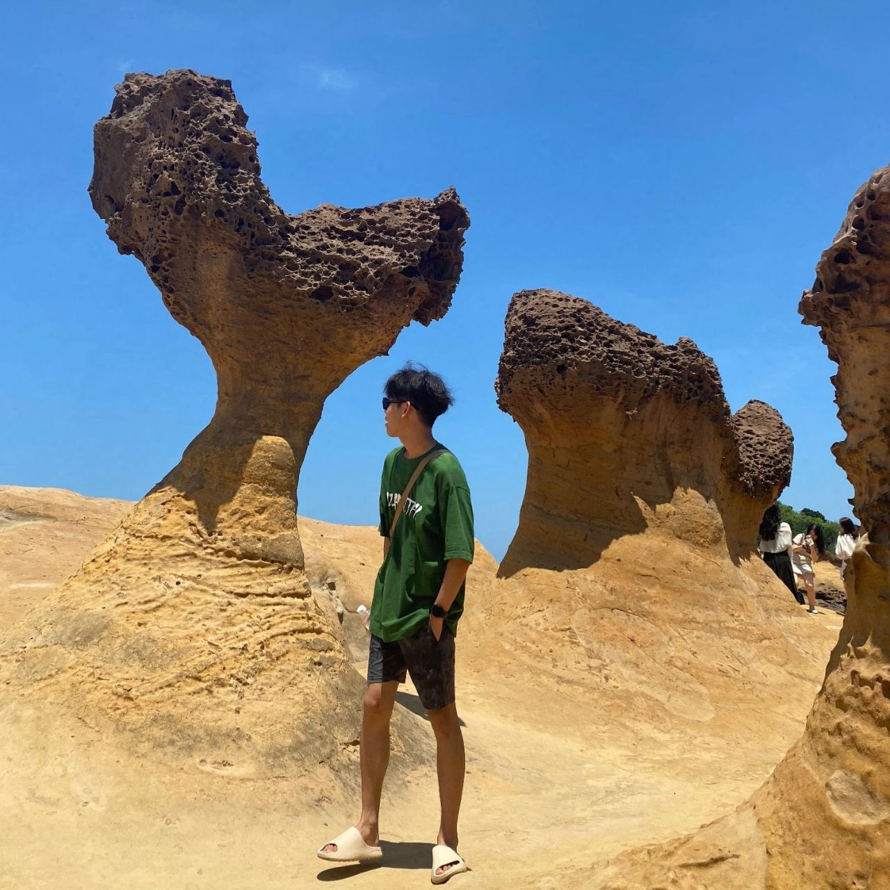
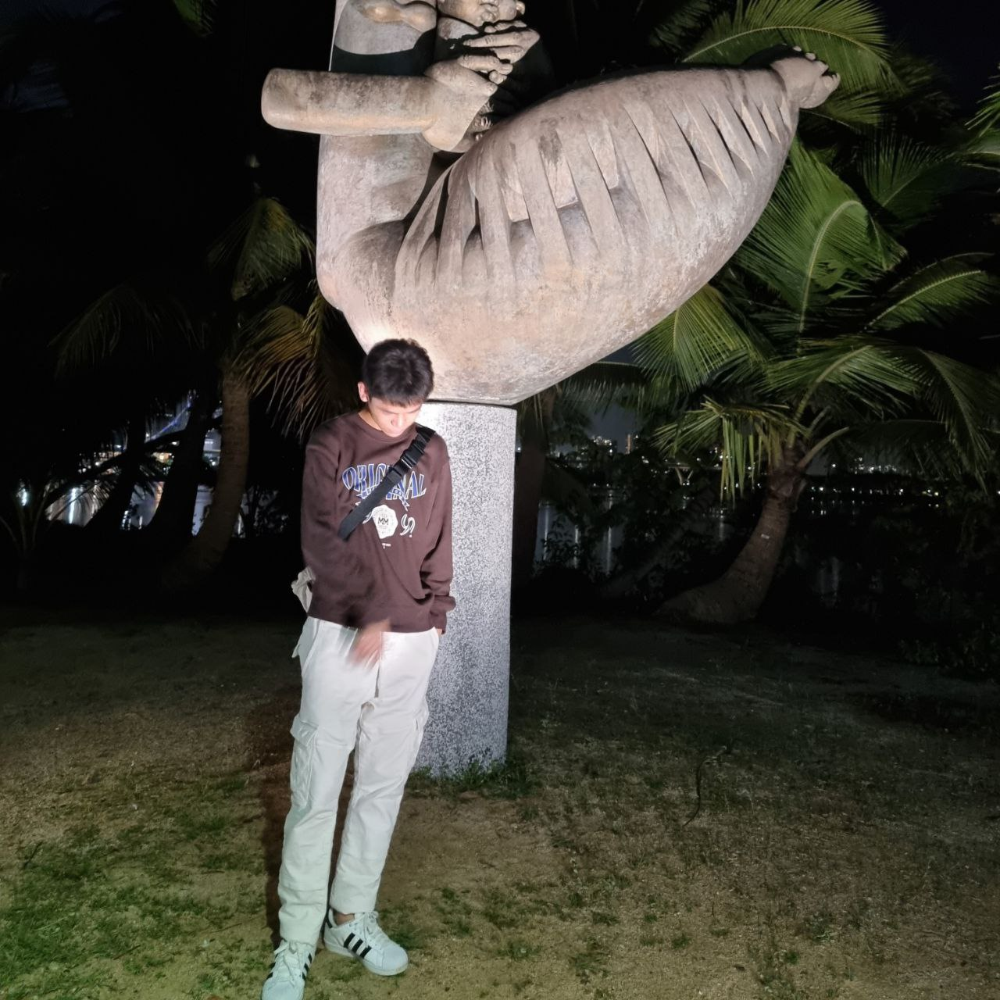
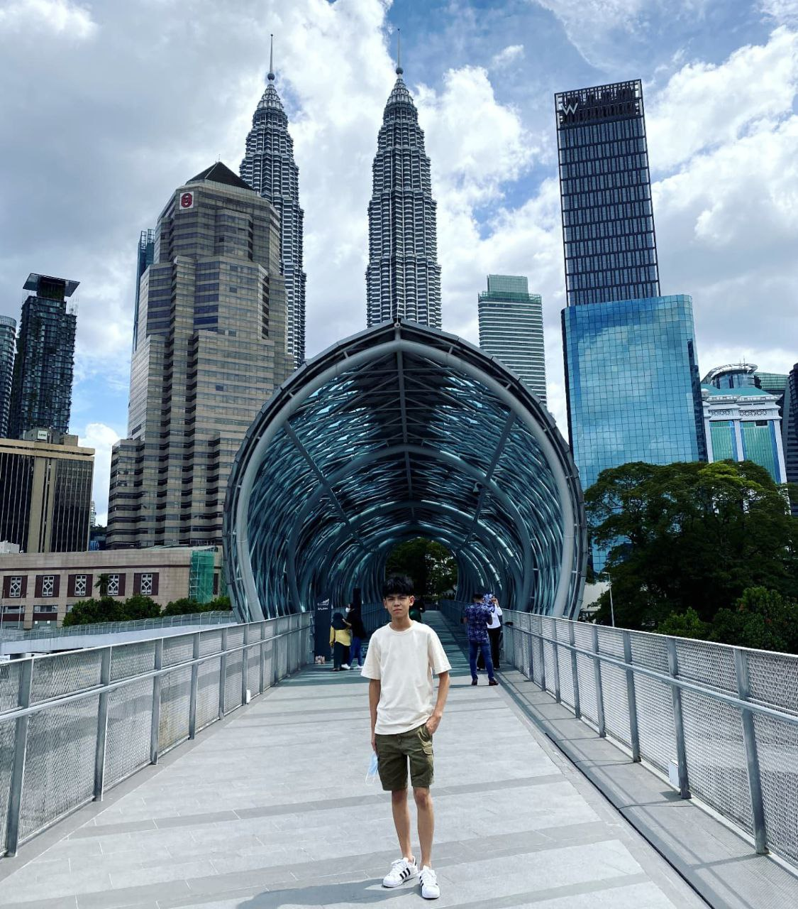
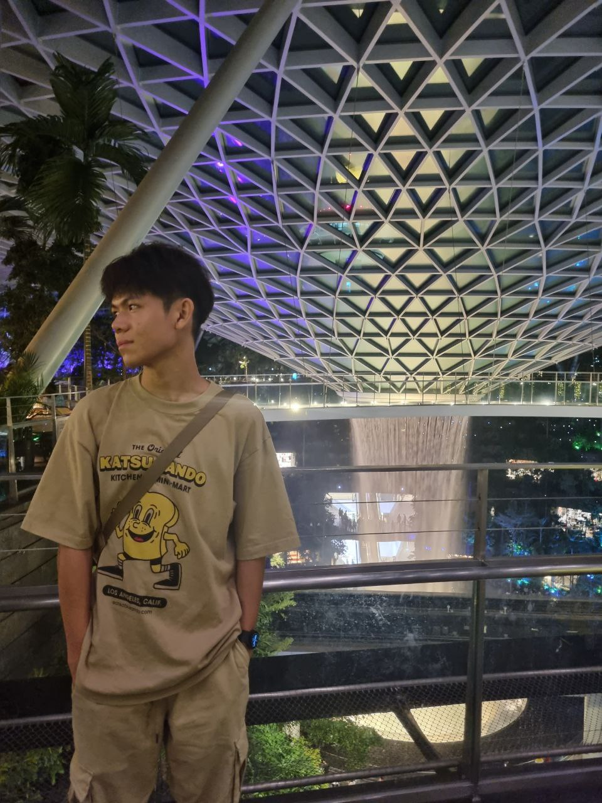
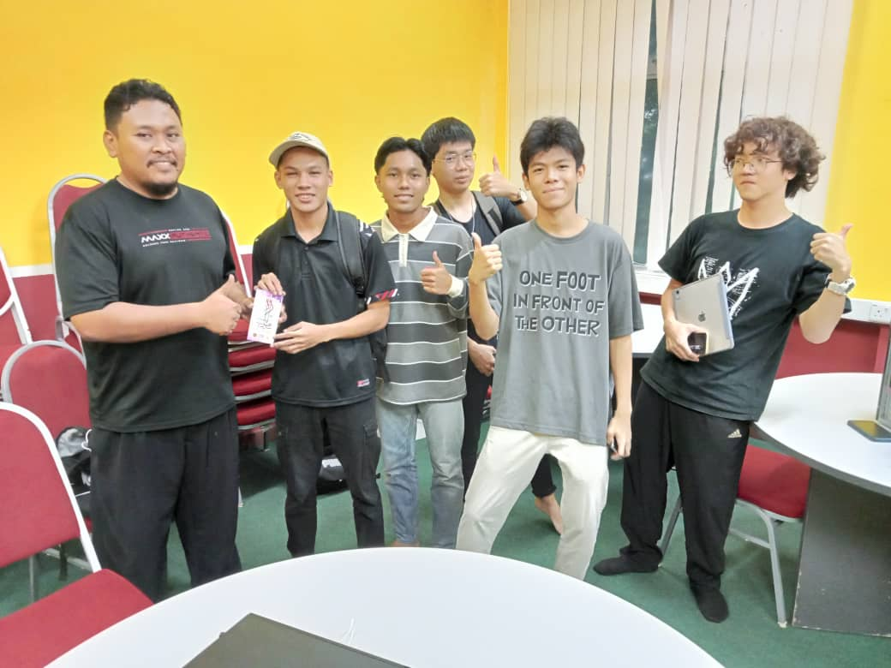

# Github Eportfolio

This e-portfolio will feature samples of my work, demonstrations, and artifacts to illustrate my learning journey, achievements, and what I'm capable of doing. 

I AM TEOW ZI XIAN
======================================================================================================================================

A uni student in Software Engineering
-------------------------------------
#### Here are some pictures about me

  
  

  
  

* 🌍  I'm based in JOHOR BAHRU,JOHOR
* ✉️  You can contact me at [teow@graduate.utm.my](mailto:teow@graduate.utm.my)
* 🧠  I'm learning Software engineering

## 🛠 Skills
C++

## Education
Before this, I graduated in the pre-U program "UTM FOUNDATION IN PHYSICAL SCIENCE" offered by UTM SPACE
### Certificates & Qualifications
- [MUET RESULT](https://github.com/zx823/eportfolio/blob/main/cert/MUET%20Result(1).PDF)
- [SPM RESULT](https://github.com/zx823/eportfolio/blob/main/cert/spm.pdf)
- [FOUNDATION RESULT](https://github.com/zx823/eportfolio/blob/main/cert/foundtranscript.pdf)

## Assignments

Here are some of my assignments

- [ASSIGNMENT 1 : REPORT ON VISIT TO NALI 2023](https://github.com/zx823/eportfolio/blob/main/TIS%20ASSIGNMENT%201%20(GRP%204)%20(3).pdf)

#### Reflection 1

Gaining valuable insights into the integration of Information and Communication Technology (ICT) in teaching and learning was a key takeaway from the visit. The diverse range of technological tools and innovative teaching methods showcased during the visit highlighted the transformative potential of ICT in education. The experience underscored the importance of ongoing professional development for educators and emphasized the need to tackle challenges associated with equitable access to technology. In essence, the visit has not only broadened my perspective on the role of ICT in education but has also instilled a commitment to incorporating technology into future teaching practices, aiming for a more engaging and student-centered learning environment.

- [ASSIGNMENT 2 : POSTER ON INDUSTRIAL TALK 1](https://github.com/zx823/eportfolio/blob/main/Tis%20Assign%202%20poster.jpg)

#### Reflection 2
This assignment led us into the realm of ICT jobs, where our focus centered on crafting a poster that illuminates the varied roles within Clarity Network. Throughout this exploration, we gained valuable insights into the specific job scopes of different positions in the ICT industry. The hands-on experience has endowed us with a clearer comprehension of the dynamic possibilities that lie ahead, shaping our perspective on the roles we could potentially embrace in the ever-evolving field of information and communication technology.

- [ASSIGNMENT 3 : VIDEO ON VISIT TO UTMDIGITAL AND THE ATTENDED VIRTUAL TALK](https://github.com/zx823/eportfolio/blob/main/TIS%20ASSIGN%203%20%20GRP%204%20(1).pdf)

#### Reflection 3

In the course of this assignment, we delved into the operations of UTM Digital, a hub responsible for housing the university server (specifically, UTM's server). Our exploration extended to unraveling the inner workings of the WiFi infrastructure, server operations, and the various components contributing to the seamless functioning of the organization, which plays a pivotal role in hosting the university's server. Immersing ourselves in this working environment, we not only familiarized ourselves with the technical aspects but also gained valuable insights into the problem-solving methodologies employed by the team. This firsthand experience provided us with a comprehensive understanding of job scopes, enabling us to appreciate the diverse skills required to navigate the challenges within UTM Digital, especially in its role as the home for the university server.

- [ASSIGNMENT 4 : REPORT ON INDUSTRIAL TALKS 2A](https://github.com/zx823/eportfolio/blob/main/GROUP4%20INDUSTRIAL%20TALK%202.pdf)

#### Reflection 4

Becoming a successful system developer involves adopting a well-rounded approach, balancing technical proficiency with interpersonal skills. I aim to enhance my programming abilities, gain a deep understanding of system architecture, and keep pace with evolving technologies. Alongside, I recognize the value of cultivating soft skills such as effective communication and collaboration. Actively participating in internships and specialized programs will provide practical insights, allowing me to apply theoretical knowledge to real-world situations. Success demands meticulous planning – creating a timeline, establishing achievable goals, and consistently assessing progress. This proactive strategy is my key to staying adaptable to emerging trends, ultimately shaping me into a highly skilled and sought-after system developer.

- ASSEMBLE PC LAB

#### Reflection
During this lab, we got hands-on with building a PC, diving deep into the intricacies of its components. This practical experience not only honed our skills in PC assembly but also provided valuable insights into the core elements powering these tech wonders. The immersive exploration expanded our understanding and gave us a practical grasp of how different components work together. As we tackled the complexities of PC assembly, each component's significance became clear, leading to a deeper appreciation and comprehension of the technology driving modern computing.
- [ASSIGNMENT5 :DESIGN THINKING](https://github.com/zx823/eportfolio/blob/main/TIS%20FINAL%20PROJECT.pdf)

#### Reflection 5

As a year 1 university student, my academic journey is
fueled by a desire to deeply engage with industries
aligning with my future aspirations. The design thinking
project has been transformative, offering insights into
market demands and helping shape a clear career aim.
This experience has provided valuable clarity about the
market landscape, fueling a commitment to continuous
improvement. I aim to thrive in the competitive corporate
world by exposing myself to diverse environments,
broadening my horizons, and actively developing both
hard and soft skills.
In summary, the design thinking project has been
instrumental in crystallizing my professional direction, and
I'm dedicated to a path of continuous growth to excel in
my envisioned industry.
